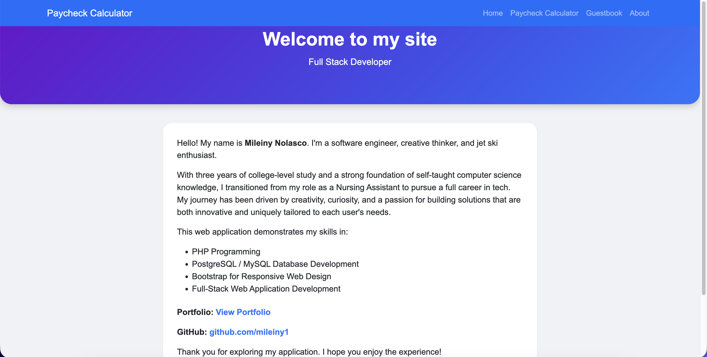

Paycheck Calculator & Guestbook Web Application

A full-stack web application built with PHP, MySQL, and Bootstrap, featuring a Paycheck Calculator and a Guestbook.

🚀 Features
1. Paycheck Calculator

Enter hours worked and hourly rate.

Calculates:

Gross Pay

Tax (15%)

Net Pay

Responsive layout using Bootstrap cards.

Displays results on a dedicated page.

2. Guestbook

Visitors can submit name and message.

Messages stored in a MySQL database (guestbook_app → guestbook_entries).

Displayed in reverse chronological order.

Secure form submission using prepared statements.

3. About Page

Introduces developer Mileiny Nolasco.

Highlights technical skills and links to portfolio & GitHub.

🗂 Project Structure
/project-root
│── index.php                 # Home page
│── guestbook.php             # Guestbook form & display
│── nav.php                   # Navbar included in pages
│── config.php                # Database connection
│── paycheckCalculator.php    # Input form for paycheck calculation
│── paycheckResult.php        # Displays paycheck results
└── about.php                 # About the developer page

💻 Technologies Used

PHP 8+

MySQL / MariaDB

HTML5 & CSS3

Bootstrap 5

JavaScript (for Bootstrap components)

⚙ Installation & Setup

Clone the repository:

git clone https://github.com/mileiny1/paycheck-guestbook-app.git

Create a MySQL database named guestbook_app.

Create the guestbook_entries table:

CREATE TABLE guestbook_entries (
    id INT AUTO_INCREMENT PRIMARY KEY,
    name VARCHAR(100),
    message TEXT,
    submitted_at TIMESTAMP DEFAULT CURRENT_TIMESTAMP
);

Update config.php with your database credentials.

Deploy on a PHP-enabled server (e.g., XAMPP, MAMP, InfinityFree).

Access pages:

paycheckCalculator.php → Paycheck Calculator

guestbook.php → Guestbook

